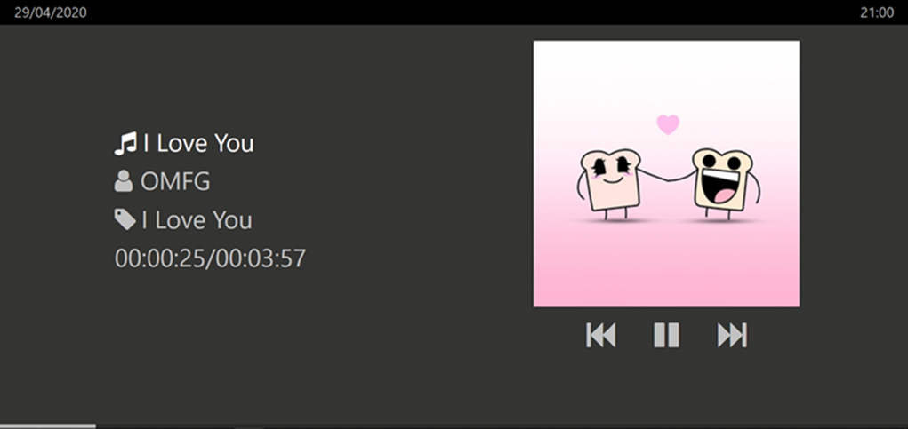

# [Lovspotify Spotify Client for Raspberry Pi, Ubuntu and Debian](https://lovspotify.github.io/lovspotify)
## Introduction

Lovspotify is a [Spotify Connect](https://www.spotify.com/connect/) for
[Debian package and associated repository](https://en.wikipedia.org/wiki/Deb_\(file_format\))
which thinly wraps the awesome
[librespot-java](https://github.com/librespot-org/librespot-java) library by
[Gianluca Altomani](https://github.com/devgianlu) and others. It works out of the box on
all three revisions of the Pi, immediately after installation.



## Download Latest Version

### Installation for Raspberry Pi

This command downloads and installs the Debian package and adds its apt repository, which ensures you'll always be up to date with upstream changes.
```
curl -sL https://spocon.github.io/spocon/script/install_lovspotify.sh | sh
```
That's it! Plug a speaker into your Pi on your local network, select the device in Spotify et voilà!

### Installation Ubuntu and Debian 
```
sudo add-apt-repository ppa:spocon/lovspotify
sudo apt-get -y update
sudo apt-get install lovspotify 
```

### Hard installation

Essentially, here's what the easy installer does,
```
# Add repo and its GPG key
sudo apt-key adv --keyserver keyserver.ubuntu.com --recv-keys 7DBE8BF06EA39B78
## This downloads the armhf version for Raspbian Pi
echo 'deb http://ppa.launchpad.net/spocon/lovspotify/ubuntu bionic main' | sudo tee /etc/apt/sources.list.d/lovspotify.list

# Install package
sudo apt-get update
sudo apt-get -y install lovspotify
```

### Uninstalling

To uninstall, remove the package,

```bash
sudo apt-get remove -y lovspotify
```

To completely remove lovspotify and its Debian repository from your system try,
```bash
sudo apt-get remove -y --purge lovspotify
```

## Configuration


lovspotify should work out of the box and should be discoverable by Spotify Connect on
your local network, however you can configure it by editing `/opt/lovspotify/config.toml`
which passes arguments to [librespot-java](https://github.com/librespot-org/librespot-java).

```toml
deviceName = "lovspotify" ### Device name ###
deviceType = "COMPUTER" ### Device type (COMPUTER, TABLET, SMARTPHONE, SPEAKER, TV, AVR, STB, AUDIO_DONGLE, GAME_CONSOLE, CAST_VIDEO, CAST_AUDIO, AUTOMOBILE, WEARABLE, UNKNOWN_SPOTIFY, CAR_THING, UNKNOWN) ###
preferredLocale = "en" ### Preferred locale ###

[auth] ### Authentication ###
strategy = "ZEROCONF" # Strategy (USER_PASS, ZEROCONF, BLOB, FACEBOOK)
username = "" # Spotify username (BLOB, USER_PASS only)
password = "" # Spotify password (USER_PASS only)
blob = "" # Spotify authentication blob (BLOB only)

[zeroconf] ### Zeroconf ###
listenPort = -1 # Listen on this port (`-1` for random)
listenAll = true # Listen on all interfaces (overrides `zeroconf.interfaces`)
interfaces = "" # Listen on these interfaces (comma separated list of names)

[cache] ### Cache ###
enabled = true # Cache enabled
dir = "./cache/"
doCleanUp = true

[preload] ### Preload ###
enabled = true # Preload enabled

[time] ### Time correction ###
synchronizationMethod = "NTP" # Time synchronization method (NTP, PING, MELODY, MANUAL)
manualCorrection = 0 # Manual time correction in millis

[player] ### Player ###
autoplayEnabled = true # Autoplay similar songs when your music ends
preferredAudioQuality = "VORBIS_160" # Preferred audio quality (VORBIS_96, VORBIS_160, VORBIS_320)
enableNormalisation = true # Whether to apply the Spotify loudness normalisation
normalisationPregain = 0.0 # Normalisation pregain
initialVolume = 65536 # Initial volume (0-65536)
logAvailableMixers = true # Log available mixers
mixerSearchKeywords = "" # Mixer/backend search keywords (semicolon separated)
crossfadeDuration = 0 # Crossfade overlap time (in milliseconds)
output = "MIXER" # Audio output device (MIXER, PIPE, STDOUT)
releaseLineDelay = 20 # Release mixer line after set delay (in seconds)
pipe = "" # Output raw (signed) PCM to this file (`player.output` must be PIPE)
```

After editing restart the daemon by running: `sudo systemctl restart lovspotify`

## Troubleshooting

> *My volume on Spotify is 100% and it's still too quiet!*

Have you tried turning the volume up using the command `alsamixer`?

> *My Raspberry Pi does not use my USB sound card!*

Try to replace the following in the file `/usr/share/alsa/alsa.conf`:

```
defaults.ctl.card 0
defaults.pcm.card 0
```
with
```
defaults.ctl.card 1
defaults.pcm.card 1
```
> *The audio output buzzes a few seconds after audio stops!*

This is likely to be ALSA's Dynamic Audio Power Management (DAPM) shutting down
the sound module of your device to save power. If you want to disable this feature,
create a file called `snd_soc_core.conf` in `/etc/modprobe.d` with this line in:
```
options snd_soc_core pmdown_time -1
```
Once you reboot and play some sound, the issue should be gone.

> *Other issues*

File an issue and if we get it sorted, I'll add to this list.

## Donations

(I'd rather you donate to [librespot-java](https://github.com/librespot-org/librespot-java)
instead, but there's no public address for those folks.)

## Acknowledgments

Special thanks to [Paul Lietar](https://github.com/plietar) for
[librespot](https://github.com/librespot-org/librespot) (and its additional authors)


